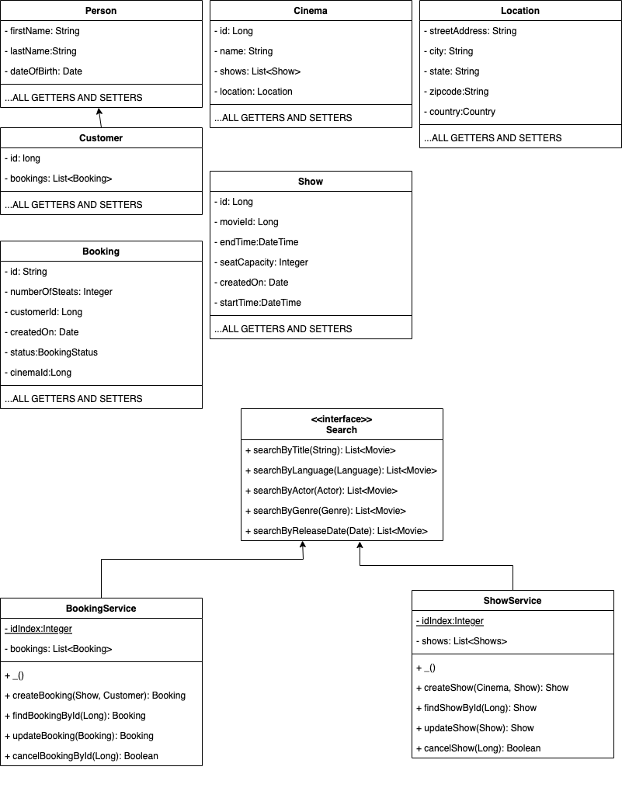

An online movie ticket booking system facilitates the purchasing of movie tickets to its customers. E-ticketing systems allow customers to browse through movies currently playing and book seats, anywhere and anytime.

## Requirements and Goals of the System

Our ticket booking service should meet the following requirements:

* Each Movie will have multiple shows at a cinema
* Customers should be able to search movies by their title, language, genre, release date, and actor
* Once the customer selects a movie, the service should display the cinemas running that movie and its available shows
* The customer should be able to select a show at a particular cinema and book their tickets.
* When booking a show if a customer selects more seats than are available the sale should not go through

## Part A

## Part B
